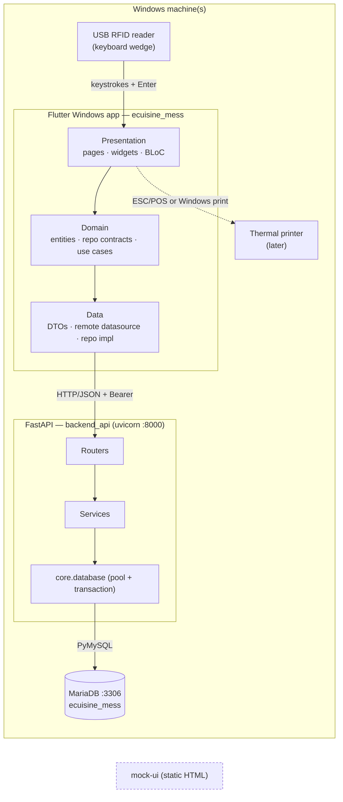
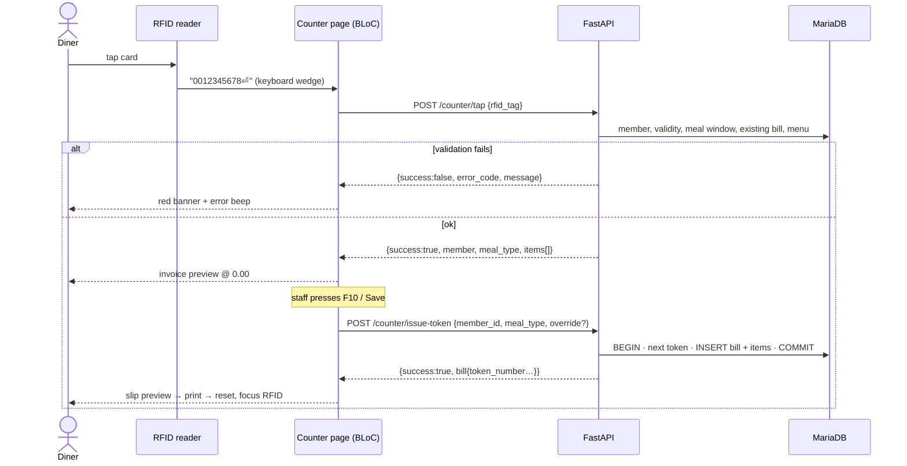

# 02 — System Architecture

## 1. Components



| Component | Path | Role | Status |
|---|---|---|---|
| **Flutter client** | `ecuisine_mess/` | Kiosk counter + back-office UI | Live (Provider) → migrating to **BLoC + GoRouter + feature-first** |
| **FastAPI backend** | `backend_api/` | REST API, business rules, DB access | Live v1.1.0 — modular (`core/ routers/ schemas/ services/`); rule/security hardening in progress |
| **MariaDB** | `database/`, `mariadb/` | System of record | Live |
| **Mock UI** | `mock-ui/` | Behavioural & visual reference | Reference only; never calls the API |
| **Frappe app** | `frappe_app/` | Optional ERPNext mirror | Parked, partial; see [08](08-gap-analysis-roadmap.md) |

## 2. Technology stack

| Layer | Choice | Notes |
|---|---|---|
| UI | Flutter 3.44 / Dart 3.12, **Windows desktop** | `flutter run -d windows` |
| State | **`flutter_bloc`** (+ `equatable`) | Separate bloc / event / state files |
| Routing | **`go_router`** | `StatefulShellRoute` for the nav rail |
| DI | `get_it` | Registered in `core/di/` |
| HTTP | `dio` (recommended) | Interceptors for Bearer + 401; plain `http` acceptable if kept behind the datasource |
| Local storage | `shared_preferences` | API base URL, session token |
| Backend | Python 3.13, **FastAPI**, uvicorn, Pydantic v2 | |
| DB driver | PyMySQL + DBUtils `PooledDB` (+ `cryptography`) | Direct SQL, no ORM (see backend docs) |
| Auth | bcrypt hashes, opaque session tokens in `mess_user_sessions` | |
| Database | **MariaDB** 10.x/11.x, utf8mb4, InnoDB | |

## 3. Runtime topology on Windows

Default is **single machine** (demo/dev). Production is **one server + N counters**.

```
Single machine                         Server + counters
─────────────────                      ──────────────────────────────────────
MariaDB   127.0.0.1:3306               Server PC:  MariaDB :3306  (bind LAN)
FastAPI   0.0.0.0:8000                             FastAPI :8000  (Windows service / NSSM)
Flutter   → http://127.0.0.1:8000      Counter PCs: Flutter .exe → http://<server-ip>:8000
```

- The client reads its API base URL from `shared_preferences` (`mess_api_base_url`, default `http://127.0.0.1:8000`) and exposes it in the **Server Settings** dialog.
- Open Windows Firewall inbound **TCP 8000** on the server only. Do **not** expose 3306 to counters — they talk to the API only.
- Time source: the **server clock** is authoritative for meal windows, validity and bill timestamps. Keep the server PC on NTP.

## 4. Key data flows

### 4.1 Counter tap → token



### 4.2 Auth

`POST /auth/login` → `{token, user}` → client stores token → Dio interceptor adds `Authorization: Bearer <token>` → any `401` clears the session **locally** (no logout call) and GoRouter redirects to `/login`.

## 5. Cross-cutting design decisions

| # | Decision | Rationale |
|---|---|---|
| AD-1 | **UUID PKs/FKs everywhere**, generated by the API | Matches schema; no collisions if sites merge later |
| AD-2 | **No master `*_code` columns** | Client override; names are the human key |
| AD-3 | Backend is authoritative for every rule; client mirrors for UX | Two counters, one truth |
| AD-4 | Flutter is **feature-first** with `data/domain/presentation` per feature | Features are independently ownable and testable |
| AD-5 | **Dependency rule:** `presentation → domain ← data`; domain has **zero** Flutter/HTTP imports | Testability |
| AD-6 | Dual route aliases (`/api/v1/*` **and** `/api/method/mess_module.api.*`) exist only for Frappe parity | Flutter targets **`/api/v1`** only |
| AD-7 | Dates over the wire: `YYYY-MM-DD`, times `HH:MM:SS`, timestamps ISO-8601 | See [06](06-engineering-standards.md) |
| AD-8 | Money is `DECIMAL(10,2)` serialised as number; always 0.00 today | Future pricing |
| AD-9 | Windows is the only supported target for the client | Scope |

## 6. Repository layout (target)

```
Mess_Module/
├── docs/                      ← common docs (this folder)
├── database/                  schema.sql · seed.sql · migrations/
├── mariadb/                   bundled MariaDB data dir + connect_db.bat (dev)
├── backend_api/
│   ├── docs/                  ← backend docs
│   ├── core/ routers/ schemas/ services/ tests/   (actual layout, see backend docs)
│   └── main.py                FastAPI app
├── ecuisine_mess/
│   ├── docs/                  ← front-end docs
│   └── lib/ …                 target feature-first layout (see front-end docs)
├── mock-ui/                   reference prototype
└── frappe_app/                optional ERPNext app (parked)
```
